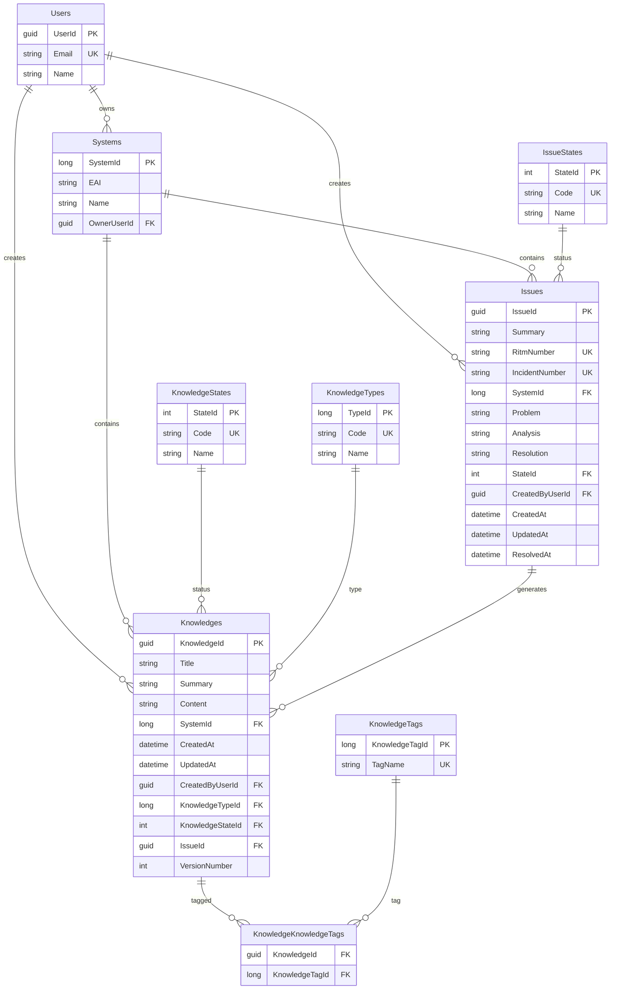

```mermaid
erDiagram

    Users {
        guid UserId PK
        string Email UK
        string Name
    }

    Systems {
        long SystemId PK
        string EAI
        string Name
        guid OwnerUserId FK
    }

    KnowledgeTags {
        long KnowledgeTagId PK
        string TagName UK
    }

    KnowledgeTypes {
        long TypeId PK
        string Code UK
        string Name
    }

    IssueStates {
        int StateId PK
        string Code UK
        string Name
    }

    KnowledgeStates {
        int StateId PK
        string Code UK
        string Name
    }

    Issues {
        guid IssueId PK
        string Summary
        string RitmNumber UK
        string IncidentNumber UK
        long SystemId FK
        string Problem
        string Analysis
        string Resolution
        int StateId FK
        guid CreatedByUserId FK
        datetime CreatedAt
        datetime UpdatedAt
        datetime ResolvedAt
    }

    Knowledges {
        guid KnowledgeId PK
        string Title
        string Summary
        string Content
        long SystemId FK
        datetime CreatedAt
        datetime UpdatedAt
        guid CreatedByUserId FK
        long KnowledgeTypeId FK
        int KnowledgeStateId FK
        guid IssueId FK
        int VersionNumber
    }

    KnowledgeKnowledgeTags {
        guid KnowledgeId FK
        long KnowledgeTagId FK
    }

    Users ||--o{ Systems : owns

    Users ||--o{ Issues : creates
    Users ||--o{ Knowledges : creates

    Systems ||--o{ Issues : contains
    Systems ||--o{ Knowledges : contains

    IssueStates ||--o{ Issues : status

    KnowledgeStates ||--o{ Knowledges : status
    KnowledgeTypes ||--o{ Knowledges : type

    Issues ||--o{ Knowledges : generates

    Knowledges ||--o{ KnowledgeKnowledgeTags : tagged
    KnowledgeTags ||--o{ KnowledgeKnowledgeTags : tag
```